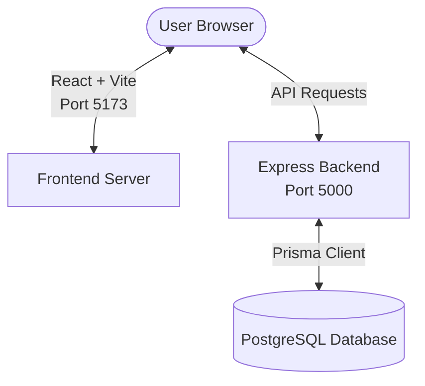

# ZPPSU Archiving System Setup Guide

This guide provides detailed instructions on how to set up, configure, and run the **ZPPSU Archiving System** on your local machine.



---

## 🛠️ Prerequisites

Before you begin, ensure you have the following installed on your system:

1. **Node.js** (v18.x or higher)
   * Check version: `node -v`
2. **npm** (v9.x or higher)
   * Check version: `npm -v`
3. **PostgreSQL Database** (v14 or higher recommended)
   * Make sure the PostgreSQL service is running.

---

## ⚙️ Configuration & Database Setup

### 1. Database Creation
First, log in to your PostgreSQL server (using pgAdmin, dBeaver, or psql CLI) and create a database named:
```sql
CREATE DATABASE zppsu_archiving_db;
```

### 2. Environment Variables Configuration
Navigate to the [backend/.env](file:///d:/Web%20development/zppsu-archiving-system/backend/.env) file:
1. Open the [backend/.env](file:///d:/Web%20development/zppsu-archiving-system/backend/.env) file.
2. Update the `DATABASE_URL` with your PostgreSQL database credentials (username, password, port, and database name):
   ```ini
   DATABASE_URL="postgresql://<your_pg_username>:<your_pg_password>@localhost:5432/zppsu_archiving_db"
   PORT=5000
   JWT_SECRET=your_jwt_secret_key_here
   EMAIL_USER=your_email@gmail.com
   EMAIL_PASS=your_email_app_password
   ```

> [!IMPORTANT]
> Replace `<your_pg_username>` and `<your_pg_password>` with your actual PostgreSQL login details. If your PostgreSQL is configured on a port other than `5432`, adjust the port accordingly.

---

## 📦 Installation & Initialization

You can install all dependencies and set up Prisma with the following simple steps.

### Step 1: Install Dependencies
Open your terminal in the project root directory (`zppsu-archiving-system`) and run:

1. **Install Backend & Shared Dependencies:**
   ```bash
   npm install
   ```
2. **Install Frontend Dependencies:**
   ```bash
   npm install --prefix frontend
   ```

### Step 2: Database Migrations & Prisma Generation
To sync your PostgreSQL database with the Prisma schema and generate the database client, run:

1. **Run Database Migrations:**
   ```bash
   npm run prisma:migrate
   ```
   *(This will create the necessary tables, columns, and relations defined in [schema.prisma](file:///d:/Web%20development/zppsu-archiving-system/backend/prisma/schema.prisma))*

2. **Generate Prisma Client:**
   ```bash
   npm run prisma:generate
   ```

---

## 🚀 Running the System

You can run both the frontend and backend concurrently (at the same time) from a single terminal window.

### Option A: Run Both Concurrently (Recommended)
From the project root directory, run:
```bash
npm run dev
```
* This command uses `concurrently` to launch:
  * **Backend server** at `http://localhost:5000`
  * **Frontend server** (Vite + React) at `http://localhost:5173` (or the next available port)

### Option B: Run in Separate Terminals

If you prefer to run them individually:

* **Backend Server:**
  Open a terminal in the root directory and run:
  ```bash
  npm run dev:backend
  ```

* **Frontend Server:**
  Open a new terminal in the root directory and run:
  ```bash
  npm run dev:frontend
  ```

---

## 🔑 Accessing the System

Once both servers are running:
1. Open your web browser and navigate to:
   * **URL:** `http://localhost:5173`
2. Since this is a fresh setup, click on **Sign Up** or **Register** on the login page.
3. Fill in your name, email, and password to create a new user account.
4. Log in using your registered credentials.
5. You can now start using the archiving system!
