# ZPPSU Archiving System — Formal System Architecture Documentation

> **Document Version:** 1.0  
> **Architecture Pattern:** 3-Tier Enterprise Architecture (Presentation • Business Logic • Persistence)  
> **Source Systems:** React (Vite) PWA • Node.js / Express.js REST API • Prisma ORM • PostgreSQL • Local File Storage  
> **Visual Style:** Minimalist Black & White • Ultra 4K UHD (3920 × 2170 px)

---

## 1. Architectural Overview

The **ZPPSU Archiving System** follows a robust, decoupled **Three-Tier Architecture** designed for high security, data integrity, auditability, and document throughput:

1. **Presentation Tier (Client Side):** Progressive Web Application (PWA) built with React, Vite, Tailwind CSS, shadcn/ui, and Lucide icons.
2. **Network & Security Boundary:** Transport-layer encryption (HTTPS) with JWT token verification, Role-Based Access Control (RBAC) middleware guards, and CORS policies.
3. **Application Tier (Business Logic):** Modular domain services in Node.js/Express handling document ingestion, OCR fallback, vector semantic indexing, inventory tracking, report compilation, and audit trails.
4. **Data Tier (Server Side & Persistence):** PostgreSQL relational database managed via Prisma ORM, coupled with local file system storage for uploaded and generated official records.

---

## 2. System Architecture Diagram

```mermaid
flowchart TB
    %% ========================================================
    %% PRESENTATION TIER (CLIENT SIDE)
    %% ========================================================
    subgraph PresentationTier ["<b>PRESENTATION TIER (CLIENT SIDE)</b>"]
        direction LR
        ClientUsers["<svg width='40' height='40' viewBox='0 0 24 24' fill='none' stroke='black' stroke-width='1.5'><path d='M20 21v-2a4 4 0 0 0-4-4H8a4 4 0 0 0-4 4v2'/><circle cx='12' cy='7' r='4'/></svg><br/><b>Users</b><br/>(Administrator / Staff)"]
        
        WebInterface["<svg width='40' height='40' viewBox='0 0 24 24' fill='none' stroke='black' stroke-width='1.5'><rect x='2' y='3' width='20' height='14' rx='2'/><line x1='8' y1='21' x2='16' y2='21'/><line x1='12' y1='17' x2='12' y2='21'/></svg><br/><b>Web Interface</b><br/>(ZPPSU Archiving System / React PWA)"]
        
        ClientFeatures["<b>Client-Side Capabilities</b><br/>• Dashboard &amp; Visual Analytics<br/>• Smart Document Upload &amp; Management<br/>• Full-Text &amp; OCR Search Filtering<br/>• Cabinet &amp; File Box Inventory Mapping<br/>• Official Report Generation (Auto-Save)<br/>• Immutable Activity Audit Logs<br/>• Staff &amp; Account Management"]

        ClientUsers <--> WebInterface <--> ClientFeatures
    end

    %% ========================================================
    %% NETWORK & SECURITY BRIDGE
    %% ========================================================
    subgraph NetBridge [" "]
        direction LR
        NetGateway["<svg width='36' height='36' viewBox='0 0 24 24' fill='none' stroke='black' stroke-width='1.5'><path d='M18 10h-1.26A8 8 0 1 0 9 20h9a5 5 0 0 0 0-10z'/></svg><br/><b>Internet / Network</b><br/>(HTTPS / REST API)"]
        
        SecurityGateway["<svg width='36' height='36' viewBox='0 0 24 24' fill='none' stroke='black' stroke-width='1.5'><path d='M12 22s8-4 8-10V5l-8-3-8 3v7c0 6 8 10 8 10z'/></svg><br/><b>Security &amp; Middleware</b><br/>(JWT, RBAC Guard, CORS)"]

        NetGateway <--> SecurityGateway
    end

    PresentationTier --> NetBridge
    NetBridge --> ApplicationTier

    %% ========================================================
    %% APPLICATION TIER (BUSINESS LOGIC)
    %% ========================================================
    subgraph ApplicationTier ["<b>APPLICATION TIER (BUSINESS LOGIC)</b>"]
        direction LR
        M_Auth["<svg width='32' height='32' viewBox='0 0 24 24' fill='none' stroke='black' stroke-width='1.5'><rect x='3' y='11' width='18' height='11' rx='2'/><path d='M7 11V7a5 5 0 0 1 10 0v4'/></svg><br/><b>Authentication &amp;<br/>Authorization</b><br/>(auth.service.js)"]
        
        M_Upload["<svg width='32' height='32' viewBox='0 0 24 24' fill='none' stroke='black' stroke-width='1.5'><path d='M14 2H6a2 2 0 0 0-2 2v16a2 2 0 0 0 2 2h12a2 2 0 0 0 2-2V8z'/><polyline points='14 2 14 8 20 8'/><line x1='12' y1='18' x2='12' y2='12'/><line x1='9' y1='15' x2='12' y2='12'/><line x1='15' y1='15' x2='12' y2='12'/></svg><br/><b>Document Ingestion<br/>&amp; Fallback OCR</b><br/>(file.upload.js)"]
        
        M_Search["<svg width='32' height='32' viewBox='0 0 24 24' fill='none' stroke='black' stroke-width='1.5'><circle cx='11' cy='11' r='8'/><line x1='21' y1='21' x2='16.65' y2='16.65'/></svg><br/><b>AI-Powered<br/>Smart Search</b><br/>(vector.service.js)"]
        
        M_Inventory["<svg width='32' height='32' viewBox='0 0 24 24' fill='none' stroke='black' stroke-width='1.5'><path d='M21 8a2 2 0 0 0-1-1.73l-7-4a2 2 0 0 0-2 0l-7 4A2 2 0 0 0 3 8v8a2 2 0 0 0 1 1.73l7 4a2 2 0 0 0 2 0l7-4A2 2 0 0 0 21 16Z'/><path d='m3.3 7 8.7 5 8.7-5'/><path d='M12 22V12'/></svg><br/><b>Cabinet &amp; Box<br/>Inventory Mapping</b><br/>(inventory.service.js)"]
        
        M_Dashboard["<svg width='32' height='32' viewBox='0 0 24 24' fill='none' stroke='black' stroke-width='1.5'><line x1='18' y1='20' x2='18' y2='10'/><line x1='12' y1='20' x2='12' y2='4'/><line x1='6' y1='20' x2='6' y2='14'/></svg><br/><b>Dashboard &amp;<br/>Monitoring</b><br/>(dashboard.service.js)"]
        
        M_Reports["<svg width='32' height='32' viewBox='0 0 24 24' fill='none' stroke='black' stroke-width='1.5'><path d='M16 4h2a2 2 0 0 1 2 2v14a2 2 0 0 1-2 2H6a2 2 0 0 1-2-2V6a2 2 0 0 1 2-2h2'/><rect x='8' y='2' width='8' height='4' rx='1'/></svg><br/><b>Report Generation<br/>(Auto-Save)</b><br/>(accomplishment.service.js)"]
        
        M_Logs["<svg width='32' height='32' viewBox='0 0 24 24' fill='none' stroke='black' stroke-width='1.5'><circle cx='12' cy='12' r='10'/><polyline points='12 6 12 12 16 14'/></svg><br/><b>Activity Logs &amp;<br/>Audit Trail</b><br/>(logs.service.js)"]
        
        M_Users["<svg width='32' height='32' viewBox='0 0 24 24' fill='none' stroke='black' stroke-width='1.5'><path d='M17 21v-2a4 4 0 0 0-4-4H5a4 4 0 0 0-4 4v2'/><circle cx='9' cy='7' r='4'/><path d='M23 21v-2a4 4 0 0 0-3-3.87'/><path d='M16 3.13a4 4 0 0 1 0 7.75'/></svg><br/><b>User &amp; Role<br/>Management</b><br/>(user.service.js)"]

        M_Auth ~~~ M_Upload ~~~ M_Search ~~~ M_Inventory ~~~ M_Dashboard ~~~ M_Reports ~~~ M_Logs ~~~ M_Users
    end

    ApplicationTier --> DataTier

    %% ========================================================
    %% DATA TIER (SERVER SIDE)
    %% ========================================================
    subgraph DataTier ["<b>DATA TIER (SERVER SIDE &amp; PERSISTENCE)</b>"]
        direction LR
        S_WebServer["<svg width='36' height='36' viewBox='0 0 24 24' fill='none' stroke='black' stroke-width='1.5'><rect x='2' y='2' width='20' height='8' rx='2'/><rect x='2' y='14' width='20' height='8' rx='2'/><line x1='6' y1='6' x2='6.01' y2='6'/><line x1='6' y1='18' x2='6.01' y2='18'/></svg><br/><b>Web Server</b><br/>(Node.js / Express.js)"]
        
        S_AppServer["<svg width='36' height='36' viewBox='0 0 24 24' fill='none' stroke='black' stroke-width='1.5'><circle cx='12' cy='12' r='3'/><path d='M19.4 15a1.65 1.65 0 0 0 .33 1.82l.06.06a2 2 0 0 1 0 2.83 2 2 0 0 1-2.83 0l-.06-.06a1.65 1.65 0 0 0-1.82-.33 1.65 1.65 0 0 0-1 1.51V21a2 2 0 0 1-2 2 2 2 0 0 1-2-2v-.09A1.65 1.65 0 0 0 9 19.4a1.65 1.65 0 0 0-1.82.33l-.06.06a2 2 0 0 1-2.83 0 2 2 0 0 1 0-2.83l.06-.06a1.65 1.65 0 0 0 .33-1.82 1.65 1.65 0 0 0-1.51-1H3a2 2 0 0 1-2-2 2 2 0 0 1 2-2h.09A1.65 1.65 0 0 0 4.6 9a1.65 1.65 0 0 0-.33-1.82l-.06-.06a2 2 0 0 1 0-2.83 2 2 0 0 1 2.83 0l.06.06a1.65 1.65 0 0 0 1.82.33H9a1.65 1.65 0 0 0 1-1.51V3a2 2 0 0 1 2-2 2 2 0 0 1 2 2v.09a1.65 1.65 0 0 0 1 1.51 1.65 1.65 0 0 0 1.82-.33l.06-.06a2 2 0 0 1 2.83 0 2 2 0 0 1 0 2.83l-.06.06a1.65 1.65 0 0 0-.33 1.82V9a1.65 1.65 0 0 0 1.51 1H21a2 2 0 0 1 2 2 2 2 0 0 1-2 2h-.09a1.65 1.65 0 0 0-1.51 1z'/></svg><br/><b>Application Server</b><br/>(Business Logic / Prisma ORM)"]
        
        S_DBServer["<svg width='36' height='36' viewBox='0 0 24 24' fill='none' stroke='black' stroke-width='1.5'><ellipse cx='12' cy='5' rx='9' ry='3'/><path d='M21 12c0 1.66-4 3-9 3s-9-1.34-9-3'/><path d='M3 5v14c0 1.66 4 3 9 3s9-1.34 9-3V5'/></svg><br/><b>Database Server</b><br/>(PostgreSQL Engine)"]

        subgraph DatabaseGroup ["<b>DATABASE &amp; FILE SYSTEM PERSISTENCE</b>"]
            direction LR
            T_Users[("users")]
            T_Files[("files<br/>(embeddings)")]
            T_Categories[("categories")]
            T_Boxes[("file_boxes")]
            T_Cabinets[("cabinets")]
            T_Logs[("logs")]
            T_Storage[("physical_files<br/>(/uploads storage)")]
            
            T_Users ~~~ T_Files ~~~ T_Categories ~~~ T_Boxes ~~~ T_Cabinets ~~~ T_Logs ~~~ T_Storage
        end

        S_WebServer <--> S_AppServer <--> S_DBServer <--> DatabaseGroup
    end

    %% ========================================================
    %% MINIMALIST BLACK & WHITE STYLING
    %% ========================================================
    classDef default fill:#ffffff,stroke:#000000,stroke-width:1.5px,color:#000000
    classDef tierBox fill:#ffffff,stroke:#000000,stroke-width:2px,color:#000000
    classDef componentBox fill:#ffffff,stroke:#000000,stroke-width:1.5px,color:#000000
    classDef tableCylinder fill:#ffffff,stroke:#000000,stroke-width:1.5px,color:#000000
    classDef hiddenBox fill:transparent,stroke:none,color:#000000
    classDef schemaBox fill:#ffffff,stroke:#000000,stroke-dasharray: 4 4,stroke-width:1.5px,color:#000000

    class PresentationTier,ApplicationTier,DataTier tierBox
    class NetBridge hiddenBox
    class DatabaseGroup schemaBox
    class ClientUsers,WebInterface,ClientFeatures,NetGateway,SecurityGateway componentBox
    class M_Auth,M_Upload,M_Search,M_Inventory,M_Dashboard,M_Reports,M_Logs,M_Users componentBox
    class S_WebServer,S_AppServer,S_DBServer componentBox
    class T_Users,T_Files,T_Categories,T_Boxes,T_Cabinets,T_Logs,T_Storage tableCylinder
```

> **Diagram Asset:** Rendered 4K image saved at [docs/diagrams/zppsu_system_architecture.png](file:///d:/Web%20development/zppsu-archiving-system/docs/diagrams/zppsu_system_architecture.png)  
> **Source File:** [docs/diagrams/zppsu_system_architecture.mmd](file:///d:/Web%20development/zppsu-archiving-system/docs/diagrams/zppsu_system_architecture.mmd)  
> **Resolution:** 3920 × 2170 px (Ultra 4K High Definition)

---

## 3. Tier Component Mapping

| Tier | Component | Technology / File Reference | Architectural Responsibility |
|---|---|---|---|
| **Presentation** | Users | Web Browser (Desktop / Mobile) | Administrator and Staff interactive sessions. |
| **Presentation** | Web Interface | React 18, Vite, Tailwind CSS, shadcn/ui | PWA client interface providing single-page routing and responsive dashboard. |
| **Network** | Network Gateway | HTTPS, JSON REST Protocol | Secure transport layer for API request-response lifecycle. |
| **Network** | Security Middleware | JWT, RBAC Middleware, CORS | Validates bearer tokens, verifies user active status, and blocks unauthorized roles. |
| **Application** | Authentication | `backend/src/modules/auth/` | Issue tokens, hash passwords (bcrypt), manage sessions. |
| **Application** | Ingestion & OCR | `backend/src/modules/file/file.upload.js` | Multipart file upload, text extraction (`officeparser`), Tesseract fallback OCR. |
| **Application** | Semantic Search | `backend/src/modules/file/vector.service.js` | Full-text query parsing, multi-field metadata filtering, vector similarity. |
| **Application** | Inventory Mapping | `backend/src/modules/inventory/` | Physical storage management; cabinet and file box capacity calculations. |
| **Application** | Dashboard Analytics | `backend/src/modules/dashboard/` | Real-time system aggregations, occupancy metrics, chart distributions. |
| **Application** | Report Generation | `backend/src/modules/accomplishment/` | Compiles Accomplishment and Inventory reports; auto-archives PDFs to storage. |
| **Application** | Activity Audit Logs | `backend/src/modules/logs/` | Immutable log recording for all mutating system actions with IP and module tracking. |
| **Application** | User Management | `backend/src/modules/user/` | Staff account creation, deactivation, password reset, and Admin protection guard. |
| **Data** | Web / API Server | Node.js, Express.js | HTTP routing, request parsing, controller dispatch, error middleware. |
| **Data** | Application Server | Prisma Client ORM | Connection pooling, SQL query generation, data normalization, transactions. |
| **Data** | Database Server | PostgreSQL Relational Database | ACiD-compliant persistence for all relational entities and vector arrays. |
| **Data** | File Storage | Local Disk (`/uploads`) | Storage for uploaded binary files (PDF, DOCX, PPTX, XLSX) and generated reports. |
