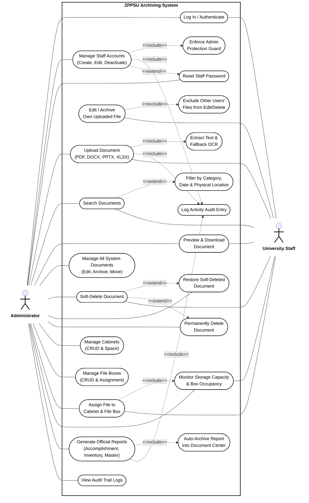

# ZPPSU Archiving System — Formal Use Case Documentation

> **Document Version:** 2.0  
> **Status:** Approved / Unified Specification  
> **Source Documents:** `docs/project-overview.md`, `docs/scope.md`, `docs/client-revisions.md`, `docs/implementation-changes.md`, `docs/staff_account_management.md`  
> **Visual Style:** Classic Black & White UML Standard • Single System Overview

---

## 1. System Overview & Scope

The **ZPPSU Archiving System** is an institutional document management and physical archiving solution for Zamboanga Peninsula Polytechnic State University (ZPPSU). It serves two primary human user roles:

1. **Administrator (`Admin`)**: Possesses global oversight and CRUD permissions across all system entities—including user accounts, categories, physical cabinets, file boxes, document retention (soft/hard deletion, restoration), and official report generation.
2. **University Staff (`User`)**: Authorized personnel performing routine archiving duties—including uploading documents (with automated content extraction and fallback OCR), searching/retrieving university archives, downloading documents, assigning physical storage coordinates, and managing their own uploaded records.

---

## 2. Unified System Use Case Diagram

The diagram below presents the complete, single-system overview adhering to classic UML 2.5 standards:
- **System Boundary:** Central enclosure defining the internal scope of the ZPPSU Archiving System.
- **Dual Actors:** `Administrator` positioned on the left; `University Staff` positioned on the right.
- **Stereotypes Applied:**
  - `<<include>>`: Mandatory execution dependencies (e.g., text extraction/OCR during upload, auto-archival upon report generation, activity logging).
  - `<<extend>>`: Optional or conditional expansions (e.g., advanced search filtering, restoring soft-deleted files, permanent record deletion).
  - `<<exclude>>`: Explicit boundary constraints (e.g., staff restriction from editing records uploaded by other users).
- **Styling:** Strict Black and White / Greyscale aesthetic for formal academic and technical documentation.

> **Diagram Asset:** Rendered standalone image saved at [docs/diagrams/zppsu_system_use_case.png](file:///d:/Web%20development/zppsu-archiving-system/docs/diagrams/zppsu_system_use_case.png)  
> **Source File:** [docs/diagrams/zppsu_system_use_case.mmd](file:///d:/Web%20development/zppsu-archiving-system/docs/diagrams/zppsu_system_use_case.mmd)

---

## 3. Actor-to-Use-Case Responsibility Matrix

| Area | Use Case | Admin | Staff | Relationship / Stereotype |
|---|---|:---:|:---:|---|
| **Access** | Log In / Authenticate | ✅ | ✅ | Primary entry point |
| **Users** | Reset Staff Password | ✅ | ❌ | `<<extend>>` via Manage Staff (Admin-only) |
| **Users** | Manage Staff Accounts | ✅ | ❌ | Includes role-guard validation |
| **Users** | Enforce Admin Protection Guard | ⚙️ | ❌ | `<<include>>` via Manage Staff |
| **Files** | Upload Document (PDF/DOCX/PPTX/XLSX) | ✅ | ✅ | Initiates ingestion workflow |
| **Files** | Extract Text & Fallback OCR | ⚙️ | ⚙️ | `<<include>>` via Upload Document |
| **Files** | Search Documents | ✅ | ✅ | Full-text & metadata query |
| **Files** | Filter by Category / Location | ✅ | ✅ | `<<extend>>` via Search Documents |
| **Files** | Preview & Download Document | ✅ | ✅ | Read access to active files |
| **Files** | Edit / Archive Own Uploaded File | ❌ | ✅ | Scoped to `uploaded_by === user.id` |
| **Files** | Exclude Other Users' Files | ❌ | ⚙️ | `<<exclude>>` via Edit Own File |
| **Files** | Manage All System Documents | ✅ | ❌ | Unrestricted file administration |
| **Files** | Soft-Delete Document | ✅ | ✅ | Non-destructive deletion |
| **Files** | Restore Soft-Deleted Document | ✅ | ❌ | `<<extend>>` via Soft-Delete |
| **Files** | Permanently Delete Document | ✅ | ❌ | `<<extend>>` via Soft-Delete |
| **Storage** | Manage Cabinets (CRUD) | ✅ | ❌ | Physical storage unit definition |
| **Storage** | Manage File Boxes (CRUD) | ✅ | ❌ | Sub-unit definition & capacity |
| **Storage** | Assign File to Cabinet & File Box | ✅ | ✅ | Dual physical coordinate binding |
| **Storage** | Monitor Storage Capacity | ✅ | ✅ | Real-time occupancy tracking |
| **Reports** | Generate Official Reports | ✅ | ❌ | Accomplishment, Inventory, Master List |
| **Reports** | Auto-Archive into Document Center | ⚙️ | ❌ | `<<include>>` via Generate Reports |
| **Audit** | Log Activity Audit Entry | ⚙️ | ⚙️ | `<<include>>` across mutating operations |
| **Audit** | View Audit Trail Logs | ✅ | ❌ | Comprehensive institutional compliance |

---

## 4. Key Use Case Specifications

### UC-01: Smart Document Ingestion with Extraction & Fallback OCR
- **Primary Actors:** Administrator, University Staff
- **Included Use Cases:** `Extract Text & Fallback OCR`, `Log Activity Audit Entry`
- **Preconditions:** User is authenticated; file format is PDF, DOCX, PPTX, or XLSX.
- **Workflow:**
  1. User uploads document file with subject, category, and storage details.
  2. System detects file type:
     - Office documents (`DOCX`, `PPTX`, `XLSX`): machine-readable text is extracted directly via `officeparser`.
     - Standard PDF: digital text stream parsed.
     - Scanned/Image PDF: Tesseract OCR is triggered automatically.
  3. Extracted content is saved for full-text searching.
  4. System logs the `UPLOAD` audit entry.

### UC-02: Generate Official Report & Auto-Archive
- **Primary Actor:** Administrator
- **Included Use Cases:** `Auto-Archive Report into Document Center`, `Log Activity Audit Entry`
- **Preconditions:** Administrator selects report type, filters, and target **Cabinet** and **File Box**.
- **Workflow:**
  1. Admin configures date range and optional department/category filters.
  2. Admin selects target physical storage location (Cabinet and File Box).
  3. System renders the official university report PDF for download.
  4. System simultaneously archives the PDF as an official record in Document Center and binds it to the specified File Box.
  5. System increments physical document count and logs `GENERATE` event.

### UC-03: Staff Account Administration & Guard Protection
- **Primary Actor:** Administrator
- **Included Use Case:** `Enforce Admin Protection Guard`, `Log Activity Audit Entry`
- **Preconditions:** Admin is authenticated in User Management module.
- **Workflow:**
  1. Admin creates, updates, or deactivates Staff accounts.
  2. If deletion is attempted, the system verifies `targetUser.role !== "Admin"` and `targetUser.id !== currentAdmin.id`.
  3. Admin accounts cannot be deleted via the UI or API.
  4. System logs `USER_CREATE`, `USER_UPDATE`, or `USER_DELETE`.
